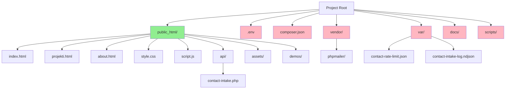

# Design Document: cPanel Hosting Migration

## Overview

This design document specifies the technical approach for migrating the Etherr marketing website from its current flat structure to a cPanel-compatible directory layout with `public_html/` as the web root. The migration reorganizes the codebase to separate public-facing assets from sensitive configuration files, runtime data, and dependencies while maintaining complete feature parity and backward compatibility.

### Goals

1. **cPanel Compatibility**: Restructure the project to work with standard cPanel shared hosting conventions
2. **Security Enhancement**: Move sensitive files (`.env`, `var/`, `vendor/`) outside the web-accessible directory
3. **Zero Downtime**: Ensure all existing features continue to work without modification to user experience
4. **Maintainability**: Preserve clear project organization and documentation
5. **Deployment Automation**: Update deployment scripts to work with the new structure

### Non-Goals

1. Changing the visual design or user interface
2. Modifying the contact form workflow or validation logic
3. Adding new features or functionality
4. Changing the technology stack (remains HTML/CSS/JS + PHP)
5. Migrating to a different hosting provider or platform

### Success Criteria

- All HTML pages load correctly from `public_html/`
- Contact form API processes submissions successfully
- All asset references (CSS, JS, images) resolve correctly
- Environment configuration loads from outside web root
- Runtime storage (rate limiting, logs) works from outside web root
- Composer dependencies load correctly from outside web root
- Local development scripts work with new structure
- All validation scripts pass
- Documentation reflects new structure

## Architecture

### Current Structure

```
etherr-website/
├── .env                          # Environment configuration
├── .cpanel.yml                   # Deployment automation
├── .gitignore                    # Git exclusions
├── composer.json                 # PHP dependencies
├── composer.lock                 # Dependency lock file
├── README.md                     # Project documentation
├── index.html                    # Homepage
├── projekti.html                 # Projects page
├── about.html                    # About page
├── privacy.html                  # Privacy policy
├── style.css                     # Global styles
├── script.js                     # Global JavaScript
├── shared-header.js              # Shared navigation
├── api/
│   ├── README.md
│   └── contact-intake.php        # Contact form endpoint
├── assets/                       # Media and project assets
│   ├── images/                   # Global UI assets
│   ├── almagea/                  # Project-specific assets
│   ├── juvy/
│   ├── dfa/
│   ├── kota/
│   ├── qr-digital-pricelist/
│   └── ripple/
├── demos/                        # Demo pages for iframes
│   ├── almagea/
│   ├── juvy/
│   └── ...
├── docs/                         # Documentation
│   ├── PROJECT-STRUCTURE.md
│   ├── DEPLOYMENT-CHECKLIST.md
│   ├── SECURITY-CHECKLIST.md
│   └── MAINTENANCE.md
├── scripts/                      # Development and validation scripts
│   ├── start-localhost3000.sh
│   ├── stop-localhost3000.sh
│   ├── check-site.sh
│   └── smoke-contact-api.sh
├── var/                          # Runtime data (not committed)
│   ├── contact-rate-limit.json
│   └── contact-intake-log.ndjson
└── vendor/                       # Composer packages (not committed)
    └── phpmailer/
```

### Target Structure

```
etherr-website/
├── .env                          # Environment configuration (OUTSIDE web root)
├── .cpanel.yml                   # Deployment automation (OUTSIDE web root)
├── .gitignore                    # Git exclusions (OUTSIDE web root)
├── composer.json                 # PHP dependencies (OUTSIDE web root)
├── composer.lock                 # Dependency lock file (OUTSIDE web root)
├── README.md                     # Project documentation (OUTSIDE web root)
├── docs/                         # Documentation (OUTSIDE web root)
│   ├── PROJECT-STRUCTURE.md
│   ├── DEPLOYMENT-CHECKLIST.md
│   ├── SECURITY-CHECKLIST.md
│   └── MAINTENANCE.md
├── scripts/                      # Development scripts (OUTSIDE web root)
│   ├── start-localhost3000.sh
│   ├── stop-localhost3000.sh
│   ├── check-site.sh
│   └── smoke-contact-api.sh
├── var/                          # Runtime data (OUTSIDE web root, not committed)
│   ├── contact-rate-limit.json
│   └── contact-intake-log.ndjson
├── vendor/                       # Composer packages (OUTSIDE web root, not committed)
│   └── phpmailer/
└── public_html/                  # WEB ROOT - publicly accessible
    ├── index.html                # Homepage
    ├── projekti.html             # Projects page
    ├── about.html                # About page
    ├── privacy.html              # Privacy policy
    ├── style.css                 # Global styles
    ├── script.js                 # Global JavaScript
    ├── shared-header.js          # Shared navigation
    ├── api/
    │   ├── README.md
    │   └── contact-intake.php    # Contact form endpoint
    ├── assets/                   # Media and project assets
    │   ├── images/
    │   ├── almagea/
    │   ├── juvy/
    │   ├── dfa/
    │   ├── kota/
    │   ├── qr-digital-pricelist/
    │   └── ripple/
    └── demos/                    # Demo pages for iframes
        ├── almagea/
        ├── juvy/
        └── ...
```

### Directory Structure Diagram



**Legend:**
- 🟢 Green: Public-facing files (inside `public_html/`)
- 🔴 Pink: Sensitive/non-public files (outside `public_html/`)

### Path Resolution Strategy

The migration requires updating path references in three contexts:

1. **Browser-side references** (HTML, CSS, JS): Remain relative within `public_html/`
2. **Server-side references** (PHP): Use `dirname(__DIR__)` to traverse up from `public_html/api/` to project root
3. **Development scripts** (Bash): Update to serve from `public_html/` directory

#### PHP Path Resolution Pattern

```php
// Current pattern (from api/contact-intake.php):
$rootDir = dirname(__DIR__);  // Points to project root
$env = loadEnvFile($rootDir . '/.env');
$autoload = $rootDir . '/vendor/autoload.php';
$storageDir = $rootDir . '/var';

// After migration (from public_html/api/contact-intake.php):
$rootDir = dirname(__DIR__, 2);  // Go up two levels: api/ -> public_html/ -> root
$env = loadEnvFile($rootDir . '/.env');
$autoload = $rootDir . '/vendor/autoload.php';
$storageDir = $rootDir . '/var';
```

## Components and Interfaces

### 1. File Migration Component

**Responsibility**: Move files from current structure to target structure

**Operations**:
- `movePublicAssets()`: Move HTML, CSS, JS, assets, demos to `public_html/`
- `keepPrivateFiles()`: Keep .env, vendor/, var/, docs/, scripts/ outside `public_html/`
- `preserveStructure()`: Maintain exact directory hierarchy within moved folders

**Constraints**:
- Must preserve file permissions
- Must handle symbolic links correctly
- Must not break during partial migration (atomic operations)

### 2. Path Reference Updater

**Responsibility**: Update file path references to reflect new structure

**Sub-components**:

#### 2.1 HTML Reference Updater
- **Input**: HTML files in `public_html/`
- **Output**: Updated HTML with corrected paths
- **Operations**:
  - Update `<link href="...">` for CSS
  - Update `<script src="...">` for JavaScript
  - Update `` for images
  - Update `<iframe src="...">` for demo pages
  - Update `<a href="...">` for internal links

#### 2.2 CSS Reference Updater
- **Input**: CSS files in `public_html/`
- **Output**: Updated CSS with corrected paths
- **Operations**:
  - Update `url(...)` for background images
  - Update `@import` statements
  - Update font file references

#### 2.3 JavaScript Reference Updater
- **Input**: JS files in `public_html/`
- **Output**: Updated JS with corrected paths
- **Operations**:
  - Update API endpoint URLs
  - Update dynamic asset loading paths
  - Update iframe src assignments

#### 2.4 PHP Reference Updater
- **Input**: PHP files in `public_html/api/`
- **Output**: Updated PHP with corrected paths
- **Operations**:
  - Update `dirname(__DIR__)` to `dirname(__DIR__, 2)`
  - Update relative paths to .env, vendor/, var/
  - Verify autoloader path resolution

### 3. Environment Configuration Loader

**Responsibility**: Load `.env` file from outside web root

**Current Implementation**:
```php
$rootDir = dirname(__DIR__);  // From api/ to root
$env = loadEnvFile($rootDir . '/.env');
```

**Updated Implementation**:
```php
$rootDir = dirname(__DIR__, 2);  // From api/ to public_html/ to root
$env = loadEnvFile($rootDir . '/.env');
```

**Interface**:
- `loadEnvFile(string $path): array` - Parse .env file into key-value array
- `envValue(array $env, string $key, string $default): string` - Get string value
- `envBool(array $env, string $key, bool $default): bool` - Get boolean value

### 4. Composer Autoloader Resolver

**Responsibility**: Load PHPMailer from vendor/ outside web root

**Current Implementation**:
```php
$autoload = dirname(__DIR__) . '/vendor/autoload.php';
require_once $autoload;
```

**Updated Implementation**:
```php
$autoload = dirname(__DIR__, 2) . '/vendor/autoload.php';
require_once $autoload;
```

**Verification**:
- Check `is_file($autoload)` before requiring
- Return error if autoloader not found
- Verify PHPMailer class exists after loading

### 5. Runtime Storage Manager

**Responsibility**: Read/write rate limit and log data outside web root

**Current Implementation**:
```php
$storageDir = $rootDir . '/var';
$rateFile = rtrim($storageDir, '/') . '/contact-rate-limit.json';
$logFile = rtrim($storageDir, '/') . '/contact-intake-log.ndjson';
```

**Updated Implementation**:
```php
$rootDir = dirname(__DIR__, 2);
$storageDirRaw = envValue($env, 'INTAKE_STORAGE_DIR', 'var');
$storageDir = isAbsolutePath($storageDirRaw) ? $storageDirRaw : $rootDir . '/' . ltrim($storageDirRaw, '/');
$rateFile = rtrim($storageDir, '/') . '/contact-rate-limit.json';
$logFile = rtrim($storageDir, '/') . '/contact-intake-log.ndjson';
```

**Operations**:
- `enforceRateLimit()`: Read/write rate limit state
- `appendLog()`: Append submission to NDJSON log
- `ensureStorageDir()`: Create var/ if missing

### 6. Local Development Server

**Responsibility**: Serve site from `public_html/` during development

**Current Implementation**:
```bash
cd "$ROOT_DIR"
php -S "127.0.0.1:${PORT}" -t "$ROOT_DIR"
```

**Updated Implementation**:
```bash
cd "$ROOT_DIR"
php -S "127.0.0.1:${PORT}" -t "$ROOT_DIR/public_html"
```

**Changes**:
- Add `-t "$ROOT_DIR/public_html"` to specify document root
- Update PID and log file paths to remain in project root
- Update success message to clarify serving from public_html/

### 7. Deployment Automation

**Responsibility**: Deploy only public_html/ contents to cPanel web root

**Current `.cpanel.yml`**:
```yaml
deployment:
  tasks:
    - export DEPLOYPATH=/home/sipandst/public_html/
    - /usr/bin/rsync -av --delete --exclude=".git" --exclude=".cpanel.yml" ./ $DEPLOYPATH
```

**Updated `.cpanel.yml`**:
```yaml
deployment:
  tasks:
    - export DEPLOYPATH=/home/sipandst/public_html/
    - /usr/bin/rsync -av --delete --exclude=".git" ./public_html/ $DEPLOYPATH
```

**Key Changes**:
- Deploy from `./public_html/` instead of `./`
- Remove `.cpanel.yml` exclusion (file is outside public_html/)
- Sensitive files (.env, vendor/, var/) never deployed (outside public_html/)

### 8. Validation Scripts

**Responsibility**: Verify site integrity after migration

**Scripts to Update**:

#### 8.1 `scripts/check-site.sh`
- Verify HTML files exist in `public_html/`
- Check for broken asset references
- Validate PHP syntax
- Check iframe src attributes

#### 8.2 `scripts/smoke-contact-api.sh`
- Test API endpoint at `public_html/api/contact-intake.php`
- Verify environment loading
- Verify autoloader loading
- Test rate limiting
- Test validation logic

## Data Models

### File Path Model

```typescript
interface FilePath {
  current: string;      // Current path relative to project root
  target: string;       // Target path relative to project root
  isPublic: boolean;    // Whether file should be in public_html/
  type: 'html' | 'css' | 'js' | 'php' | 'asset' | 'config' | 'doc' | 'script';
}
```

### Path Reference Model

```typescript
interface PathReference {
  file: string;         // File containing the reference
  line: number;         // Line number
  column: number;       // Column number
  oldPath: string;      // Current path value
  newPath: string;      // Updated path value
  context: 'html' | 'css' | 'js' | 'php';
}
```

### Migration State Model

```typescript
interface MigrationState {
  phase: 'planning' | 'backup' | 'migration' | 'validation' | 'complete';
  filesProcessed: number;
  filesTotal: number;
  referencesUpdated: number;
  referencesTotal: number;
  errors: Array<{file: string, error: string}>;
  warnings: Array<{file: string, warning: string}>;
}
```

## Error Handling

### Migration Errors

| Error Type | Handling Strategy | Recovery |
|------------|------------------|----------|
| File not found during migration | Log error, continue with other files | Manual file placement |
| Permission denied | Log error, skip file | Fix permissions, retry |
| Path reference not found | Log warning, continue | Manual path update |
| PHP syntax error after update | Log error, revert file | Fix syntax, retry |
| Autoloader not found | Fail fast with clear message | Run composer install |
| Environment file not found | Fail fast with clear message | Create .env from .env.example |
| Storage directory not writable | Log warning, continue | Fix permissions |

### Runtime Errors (Post-Migration)

| Error Type | Current Behavior | Post-Migration Behavior |
|------------|-----------------|------------------------|
| .env not found | API returns error | Same (path updated) |
| vendor/ not found | API returns error | Same (path updated) |
| var/ not writable | Log warning, continue | Same (path updated) |
| Rate limit exceeded | Return HTTP 429 | Same |
| Invalid email | Return HTTP 422 | Same |
| SMTP failure | Return status "queued" | Same |

### Validation Errors

| Check | Failure Condition | Action |
|-------|------------------|--------|
| HTML files in public_html/ | File missing | Report error |
| Asset references resolve | 404 on asset | Report error |
| PHP syntax valid | Parse error | Report error |
| API responds | HTTP error | Report error |
| Environment loads | .env not found | Report error |
| Autoloader loads | vendor/ not found | Report error |

## Testing Strategy

### Unit Testing

Since this is primarily a structural migration with no new business logic, unit tests focus on verification rather than new functionality:

1. **Path Resolution Tests**
   - Verify `dirname(__DIR__, 2)` resolves to project root from `public_html/api/`
   - Verify relative paths within `public_html/` remain unchanged
   - Test absolute path detection logic

2. **File Existence Tests**
   - Verify all expected files exist in `public_html/`
   - Verify sensitive files remain outside `public_html/`
   - Verify directory structure preserved

3. **Reference Resolution Tests**
   - Parse HTML and verify all href/src attributes resolve
   - Parse CSS and verify all url() references resolve
   - Parse JS and verify API endpoints are correct

### Integration Testing

1. **Contact Form End-to-End**
   - Submit form with valid data
   - Verify email sent via SMTP
   - Verify rate limiting works
   - Verify logging works
   - Verify Turnstile validation (if enabled)

2. **Asset Loading**
   - Load each HTML page
   - Verify all CSS loads without 404
   - Verify all JS loads without 404
   - Verify all images load without 404
   - Verify all fonts load without 404

3. **Demo Page Embedding**
   - Load projekti.html
   - Verify all iframe src attributes load
   - Verify demo pages render correctly

4. **Language Switching**
   - Switch between HR, EN, DE
   - Verify content updates
   - Verify localStorage persistence

### Manual Testing Checklist

- [ ] Homepage loads with hero animation
- [ ] Projects page loads with all project cards
- [ ] About page loads correctly
- [ ] Privacy page loads correctly
- [ ] Language switcher works (HR, EN, DE)
- [ ] Contact form opens and displays wizard
- [ ] Contact form validates required fields
- [ ] Contact form submits successfully
- [ ] Contact form shows success message
- [ ] Project cards flip on hover/click
- [ ] Demo pages load in iframes
- [ ] All images load without errors
- [ ] All fonts load without errors
- [ ] Console shows no JavaScript errors
- [ ] Network tab shows no 404 errors

### Validation Scripts

1. **`scripts/check-site.sh`**
   - Verify file structure
   - Check PHP syntax
   - Validate HTML structure
   - Check for broken references

2. **`scripts/smoke-contact-api.sh`**
   - Test API endpoint accessibility
   - Verify environment loading
   - Verify autoloader loading
   - Test validation logic
   - Test rate limiting

### Deployment Testing

1. **Local Development**
   - Run `bash scripts/start-localhost3000.sh`
   - Verify server serves from `public_html/`
   - Test all pages and features
   - Run validation scripts

2. **Staging Environment** (if available)
   - Deploy to staging cPanel
   - Run composer install
   - Configure .env
   - Test all features
   - Run validation scripts

3. **Production Deployment**
   - Deploy via .cpanel.yml or manual rsync
   - Run composer install
   - Configure .env
   - Verify var/ directory permissions
   - Test contact form submission
   - Monitor logs for errors

## Implementation Plan

### Phase 1: Preparation

1. **Backup Current State**
   - Create Git branch: `feature/cpanel-migration`
   - Tag current state: `pre-cpanel-migration`
   - Document current file locations

2. **Create Target Structure**
   - Create `public_html/` directory
   - Create subdirectories: `api/`, `assets/`, `demos/`

### Phase 2: File Migration

1. **Move Public Assets**
   ```bash
   # HTML files
   mv *.html public_html/
   
   # CSS and JS
   mv style.css script.js shared-header.js public_html/
   
   # Directories
   mv api/ public_html/
   mv assets/ public_html/
   mv demos/ public_html/
   ```

2. **Verify Private Files Remain**
   - Confirm .env, vendor/, var/, docs/, scripts/ outside public_html/

### Phase 3: Path Reference Updates

1. **Update PHP Files**
   - Update `public_html/api/contact-intake.php`:
     - Change `dirname(__DIR__)` to `dirname(__DIR__, 2)`
     - Verify all path resolutions

2. **Update HTML Files** (if needed)
   - Check all `<link>`, `<script>`, ``, `<iframe>` tags
   - Update paths if any referenced files outside public_html/

3. **Update JavaScript Files** (if needed)
   - Check API endpoint URLs
   - Verify relative paths remain correct

### Phase 4: Development Environment

1. **Update Local Server Script**
   - Modify `scripts/start-localhost3000.sh`
   - Add `-t "$ROOT_DIR/public_html"` to PHP server command

2. **Update Validation Scripts**
   - Modify `scripts/check-site.sh` to check public_html/
   - Modify `scripts/smoke-contact-api.sh` to test from new location

### Phase 5: Deployment Configuration

1. **Update .cpanel.yml**
   - Change source from `./` to `./public_html/`
   - Remove unnecessary exclusions

2. **Update Documentation**
   - Update README.md with new structure
   - Update docs/PROJECT-STRUCTURE.md
   - Update docs/DEPLOYMENT-CHECKLIST.md
   - Update docs/SECURITY-CHECKLIST.md
   - Update api/README.md

### Phase 6: Testing

1. **Local Testing**
   - Start local server
   - Test all pages
   - Test contact form
   - Run validation scripts

2. **Fix Issues**
   - Address any broken references
   - Fix any path resolution errors
   - Update documentation as needed

### Phase 7: Deployment

1. **Deploy to Production**
   - Push changes to Git
   - Deploy via .cpanel.yml or manual rsync
   - Run composer install on server
   - Configure .env on server
   - Set var/ permissions

2. **Post-Deployment Verification**
   - Test all pages
   - Submit test contact form
   - Monitor logs
   - Verify no errors

## Documentation Updates

### Files to Update

1. **README.md**
   - Add section explaining public_html/ structure
   - Update local development instructions
   - Update deployment instructions

2. **docs/PROJECT-STRUCTURE.md**
   - Document new directory layout
   - Explain public vs. private file separation
   - Update file location references

3. **docs/DEPLOYMENT-CHECKLIST.md**
   - Add cPanel-specific deployment steps
   - Document composer install requirement
   - Document .env configuration
   - Document var/ permissions

4. **docs/SECURITY-CHECKLIST.md**
   - Highlight security benefits of new structure
   - Document that sensitive files are outside web root
   - Update file location references

5. **docs/MAINTENANCE.md**
   - Update file placement rules
   - Document where new files should go
   - Update backup procedures

6. **api/README.md**
   - Update API path references
   - Document new file locations
   - Update configuration instructions

### New Documentation

Create **docs/CPANEL-SETUP.md**:
- cPanel configuration instructions
- PHP version requirements
- Composer installation via SSH
- .env file setup
- Directory permissions
- SMTP configuration
- Troubleshooting common issues

## Security Considerations

### Benefits of New Structure

1. **Environment Configuration Protected**
   - `.env` outside web root prevents HTTP access
   - Credentials cannot be downloaded via browser

2. **Runtime Data Protected**
   - `var/` outside web root prevents log access
   - Rate limit data cannot be viewed publicly
   - Submission logs remain private

3. **Dependencies Protected**
   - `vendor/` outside web root prevents library enumeration
   - Reduces attack surface

4. **Documentation Protected**
   - `docs/` outside web root prevents information disclosure
   - Internal documentation remains private

### Additional Hardening (Optional)

1. **Add .htaccess to public_html/**
   ```apache
   # Deny access to sensitive file types
   <FilesMatch "\.(env|log|json|md|lock)$">
     Require all denied
   </FilesMatch>
   ```

2. **Add .htaccess to public_html/api/**
   ```apache
   # Only allow POST to contact-intake.php
   <Files "contact-intake.php">
     <LimitExcept POST OPTIONS>
       Require all denied
     </LimitExcept>
   </Files>
   ```

3. **Verify var/ Permissions**
   ```bash
   chmod 700 var/
   chmod 600 var/*.json
   chmod 600 var/*.ndjson
   ```

## Performance Considerations

### No Performance Impact Expected

The migration is purely structural and should not affect performance:

1. **Same File Sizes**: No files are modified in content
2. **Same HTTP Requests**: No additional requests introduced
3. **Same Caching**: Caching headers unchanged
4. **Same Execution**: PHP execution path slightly longer (one extra dirname) but negligible

### Potential Improvements

1. **Reduced Attack Surface**: Fewer files exposed to web may reduce server load from scanners
2. **Cleaner Logs**: Fewer 404s from bots trying to access .env, composer.json, etc.

## Rollback Plan

### If Migration Fails

1. **Revert Git Changes**
   ```bash
   git checkout pre-cpanel-migration
   ```

2. **Restore Deployment**
   - Deploy previous version via .cpanel.yml
   - Or manually rsync previous structure

### If Issues Found Post-Deployment

1. **Identify Issue**
   - Check error logs
   - Check browser console
   - Check network tab

2. **Quick Fix Options**
   - Fix path reference in specific file
   - Adjust PHP path resolution
   - Update .env configuration

3. **Full Rollback**
   - Revert to previous Git tag
   - Redeploy previous version
   - Restore previous .env if needed

## Future Considerations

### Potential Enhancements

1. **Build Process**: Add build step to minify CSS/JS
2. **Asset Optimization**: Compress images, optimize fonts
3. **CDN Integration**: Serve static assets from CDN
4. **Environment-Specific Configs**: Separate dev/staging/prod .env files

### Maintenance Notes

1. **New Public Files**: Always place in `public_html/`
2. **New Private Files**: Always place outside `public_html/`
3. **Path References**: Always use relative paths within `public_html/`
4. **PHP Paths**: Always use `dirname(__DIR__, 2)` to reach project root from `public_html/api/`

## Conclusion

This design provides a comprehensive approach to migrating the Etherr website to a cPanel-compatible structure. The migration enhances security by moving sensitive files outside the web root while maintaining complete feature parity. The implementation is straightforward, low-risk, and fully reversible.

Key success factors:
- Systematic file migration with verification
- Careful path reference updates
- Thorough testing at each phase
- Clear documentation updates
- Automated validation scripts

The migration positions the site for reliable hosting on standard cPanel shared hosting while improving security posture and maintainability.
